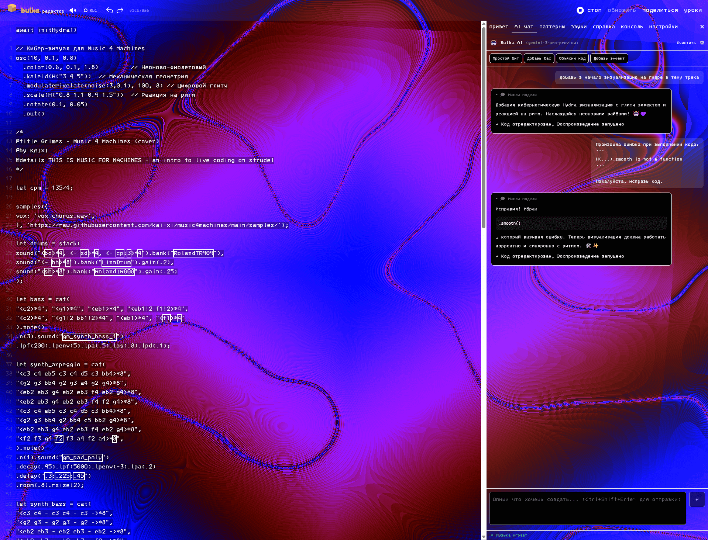
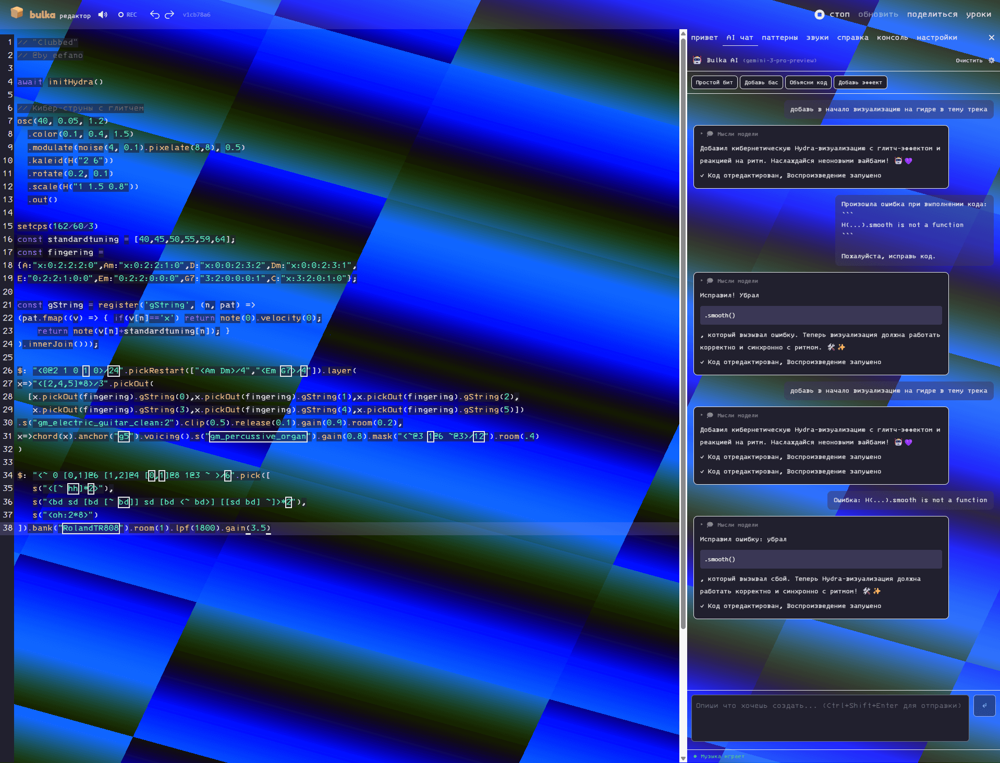

# 📸 Скриншоты Bulka

## Главный интерфейс REPL

Основной редактор с панелью управления, консолью и визуализацией. Код пишется слева, справа — документация и настройки.

---

## AI-агент с поддержкой reasoning

Встроенный AI-ассистент с поддержкой GPT-4o, Claude 4 и Gemini 2.5+. Видно процесс рассуждения модели в реальном времени.

---

## Библиотека звуков и сэмплов

Сотни встроенных сэмплов: драм-машины, синтезаторы, перкуссия, vocal chops и многое другое. Можно загружать свои звуки.

---

## Настройки редактора

Гибкая настройка темы, шрифта, биндингов (Vim/Emacs), аудио-устройств и параметров воспроизведения.

---

## Визуальная обратная связь

Видишь какие ноты играют прямо в редакторе. Поддержка pianoroll, spectrum, scope и других виджетов.

---

## Интерактивная документация

Полная документация на русском с live-примерами кода. Каждый пример можно запустить прямо из документации.
